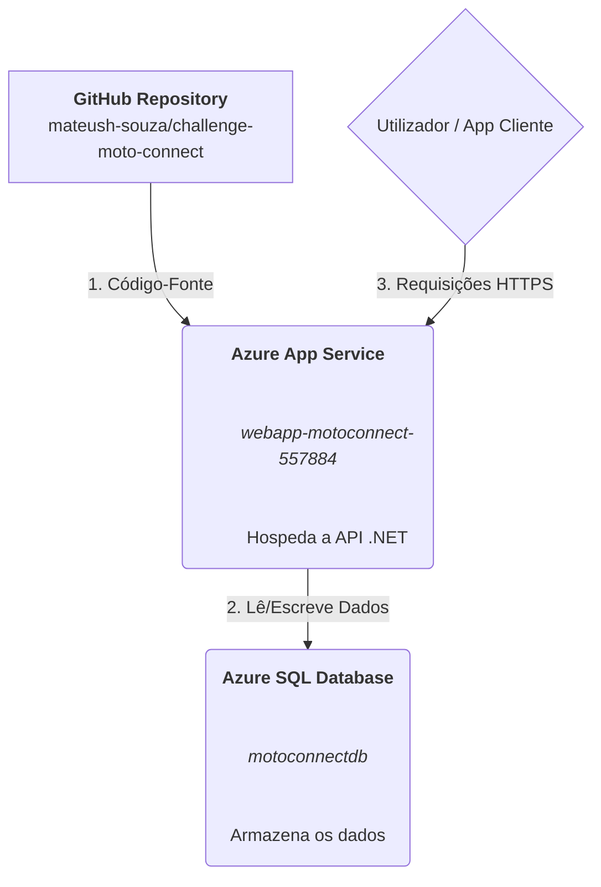

# Challenge FIAP: API Moto Connect


## Diagrama da solução


##  1. Visão Geral da Solução

A **API Moto Connect** é o backend central para a gestão da frota de motociclos da Mottu. Desenvolvida em .NET 8 com uma arquitetura limpa, a solução oferece endpoints RESTful para gerir utilizadores, veículos e o seu histórico de utilização. O projeto foi implementado na nuvem da Microsoft Azure para garantir alta disponibilidade, escalabilidade e segurança.

### Principais Benefícios

* ** Centralização da Informação:** Um único ponto de verdade para todos os dados da frota.
* ** Otimização Operacional:** Reduz a complexidade da gestão diária de veículos e utilizadores.
* ** Escalabilidade e Integração:** Preparada para crescer e ser consumida por diversas aplicações clientes (Mobile, Web, BI).

---

### Vídeo explicativo da solução:

* ** https://www.youtube.com/watch?v=yh3QLdEp4y0

---

##  2. Arquitetura da Infraestrutura

A solução foi implementada utilizando o modelo **PaaS (Plataforma como Serviço)** da Azure, com todos os recursos provisionados via **Azure CLI** para garantir a automação e a rastreabilidade (Infraestrutura como Código).



* **GitHub Repository:** Contém o código-fonte da aplicação .NET.
* **Azure App Service:** Serviço PaaS que compila e hospeda a API. Está configurado para fazer o deploy automático a partir da branch `main`.
* **Azure SQL Database:** Banco de dados relacional gerido que armazena todos os dados de forma segura.

---

##  3. Como Realizar o Deploy

O processo de deploy está totalmente automatizado através de um único script.

### Pré-requisitos

* [Azure CLI](https://docs.microsoft.com/pt-br/cli/azure/install-azure-cli) instalado e autenticado (`az login`).
* Permissões para criar recursos na sua subscrição Azure.

### Passos

1.  Clone este repositório.
2.  Abra o ficheiro `deploy.sh` e preencha as variáveis `DB_ADMIN_USER` e `DB_ADMIN_PASSWORD`.
3.  Execute o script no seu terminal:
    ```bash
    chmod +x deploy.sh
    ./deploy.sh
    ```
4.  Aguarde a finalização. A URL da sua API será exibida no final.

---

##  4. Documentação da API (Endpoints)

A API expõe os seguintes endpoints principais. A URL base é `https://webapp-motoconnect-557884.azurewebsites.net`.

### Utilizadores (`/User`)

* `GET /User`: Lista todos os utilizadores.
* `GET /User/{id}`: Obtém um utilizador específico.
* `POST /User`: Cria um novo utilizador.

    **Exemplo de Body:**
    ```json
    {
      "name": "Nome do Usuário",
      "email": "usuario@teste.com",
      "password": "Senha@123"
    }
    ```

### Veículos (`/Vehicles`)

* `GET /Vehicles`: Lista todos os veículos.
* `POST /Vehicles`: Adiciona um novo veículo.

    **Exemplo de Body:**
    ```json
    {
      "identifier": "MOTO-001",
      "year": 2025,
      "model": "Honda CG 160",
      "plate": "ABC1D23"
    }
    ```
---

##  5. Scripts de Entrega

* **[deploy.sh](deploy.sh):** Script de criação da infraestrutura e deploy.
* **[script_bd.sql](script_bd.sql):** Script DDL para a criação da estrutura do banco de dados.
